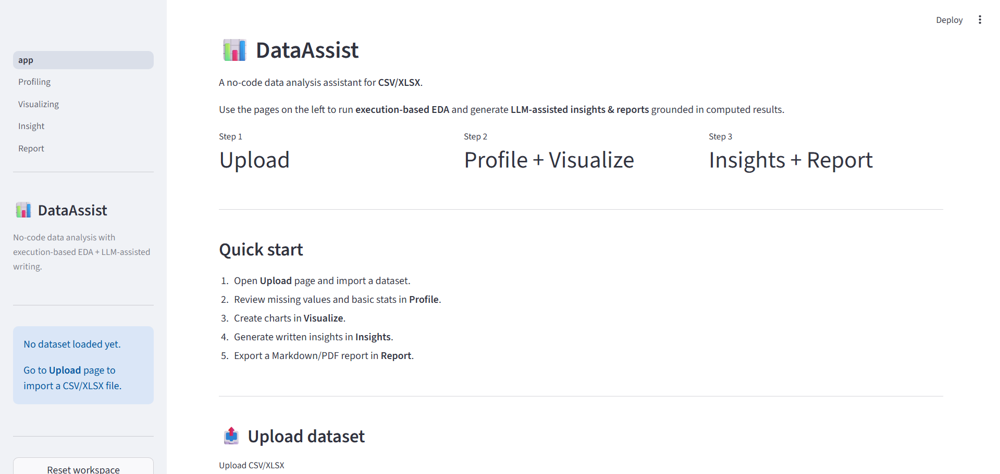
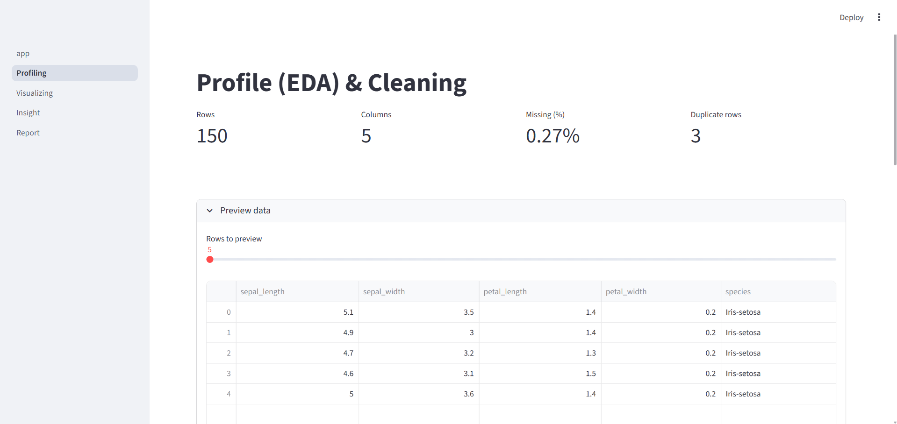
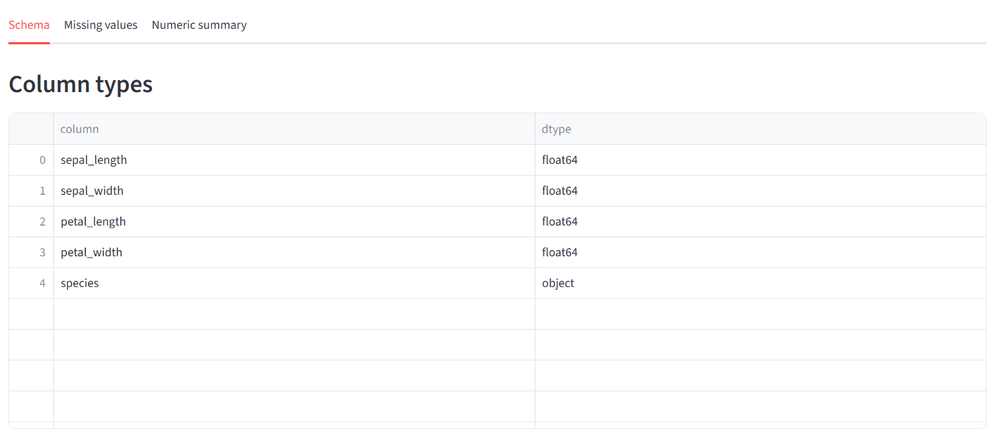
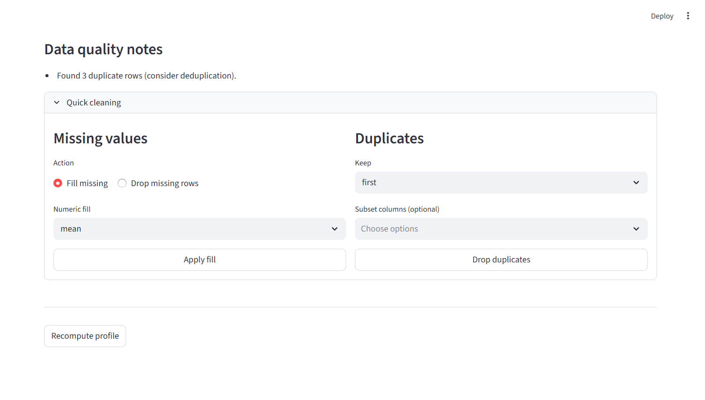
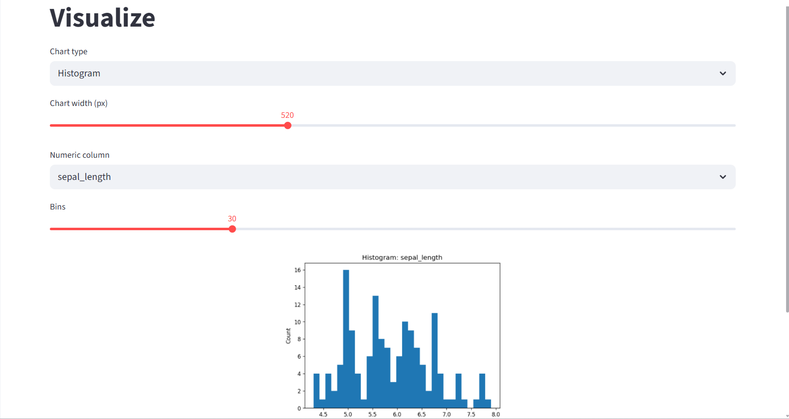
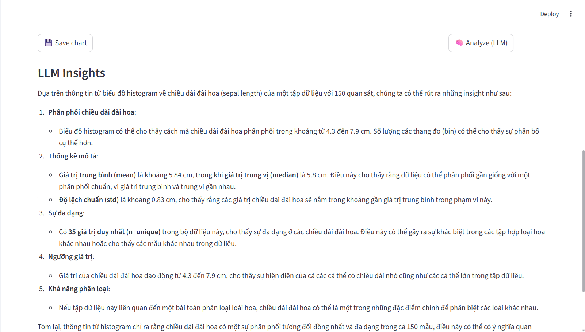
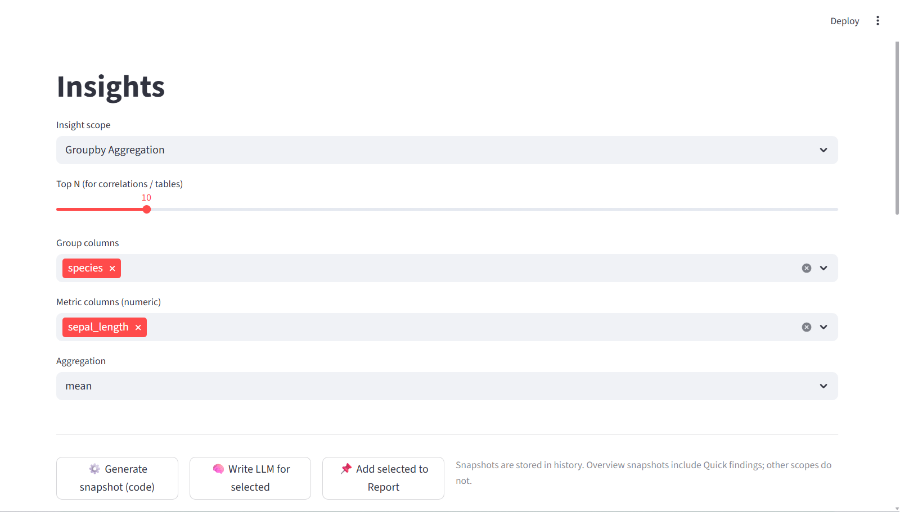
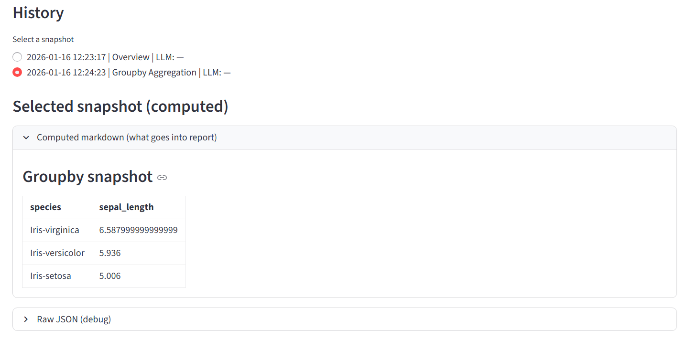
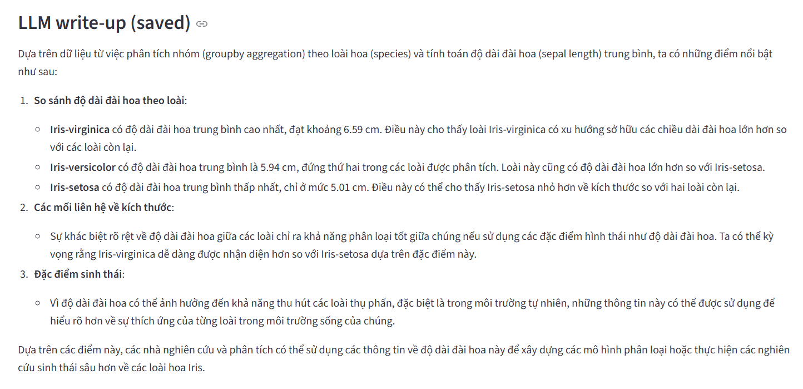
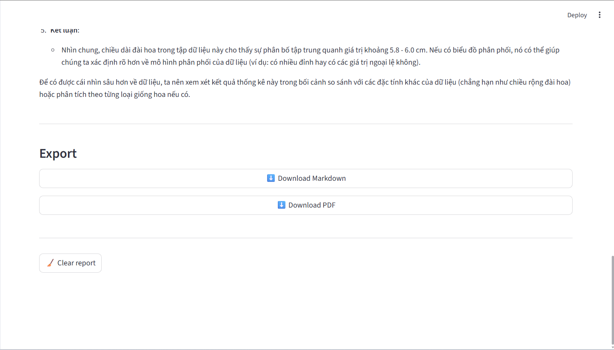

# **DataAssist – No-Code Data Analysis Assistant**

**DataAssist** is a Streamlit-based **no-code data analysis assistant** designed to help data analysts and students explore datasets, generate insights, and build reports with **execution-based EDA** and **LLM-assisted writing**.

Upload a CSV/XLSX file, inspect data quality, visualize patterns, generate insights, and export a polished Markdown/PDF report — all in one streamlined workflow.

---

## 📺 Demo Video
*(Click the badge below to watch DataAssist in action)*

[](https://youtu.be/Z5lDaEkBAAo)

---
## ✨ Key Features

- 📤 **Upload CSV/XLSX** datasets with automatic schema detection  
- 📊 **Execution-based EDA** (all statistics are computed, not hallucinated)  
- 🧹 **Data profiling**: missing values, schema inspection, numeric summaries  
- 📈 **Interactive visualizations** with chart-level LLM explanations  
- 🧠 **Insight snapshots** with history & versioning  
- 📝 **LLM-assisted report writing** grounded in computed results  
- 📄 **One-click report export** (Markdown / PDF)

---

## 🖥️ User Interface Overview

### Dashboard
<div align="center">



</div>

---

### Upload & Profiling (EDA Core)

<div align="center">



|Schema | Missing Values | Numeric Summary |
|--------|----------------|-----------------|
|  |  |  |

</div>

---

### Quick Data Quality Checks

<div align="center">



</div>

---

### Visualization & Chart Analysis

<div align="center">

| Visualization Playground | Analyze Chart |
|--------------------------|---------------|
|  |   |

   

</div>

Each chart can be:
- Saved for later use in reports  
- Analyzed by an LLM to generate **grounded, human-readable insights**

---

### Insight Generation

<div align="center">

| Generate Insight | Insight Generated | LLM Write-up |
|------------------|-------------------|--------------| 
|  |   |  |

</div>

Insights are:
- Generated via **pure code execution** (correlations, outliers, groupby stats)
- Stored as **snapshots** with full history
- Optionally enriched with **LLM-written explanations**

---

### Report Builder & Export

<div align="center">



</div>

- Combine selected insights and charts
- Append optional LLM write-ups
- Export as **Markdown** and **PDF**

---

## 🔄 Workflow

```text
Upload
  ↓
Profile (EDA)
  ↓
Visualize ──┐
  ↓         │
Insights ───┼──> Report Builder → Markdown / PDF Export
  ↓         │
LLM Writing ┘
```
All numeric results are computed by code.
The LLM is used only for writing and explanation, never for guessing statistics.

---

## 🛠️ Tech Stack
**Data & Analysis**

- Pandas, NumPy – data manipulation & statistics

- Matplotlib – chart rendering

**LLM Integration**

- External LLM via custom llm/client.py

- Prompted only with computed JSON summaries

**Web App**

- Streamlit – multi-page UI

---

## 🚀 Installation & Usage
### 1. Prerequisites

- Python 3.10+
- Git

### 2. Clone repository
```bash
git clone https://github.com/yourname/DataAssist.git
cd DataAssist
```

### 3. Install dependencies
```bash
pip install -r requirements.txt
```
### 4. Configure LLM

Create a `.env` file:
```bash
OPENAI_API_KEY=your_api_key_here
```
### 5. Run the app
```bash
streamlit run app/app.py
```

--- 

## 📄 License

This project is licensed under the MIT License.

⭐ If you find this project useful, consider starring the repo!